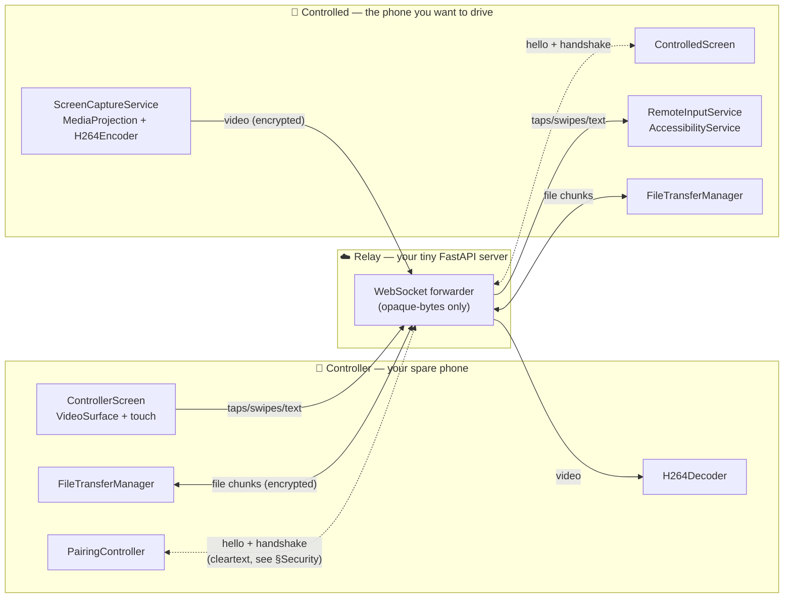
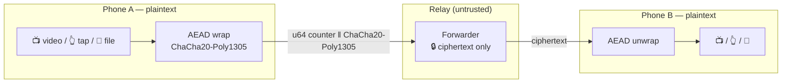
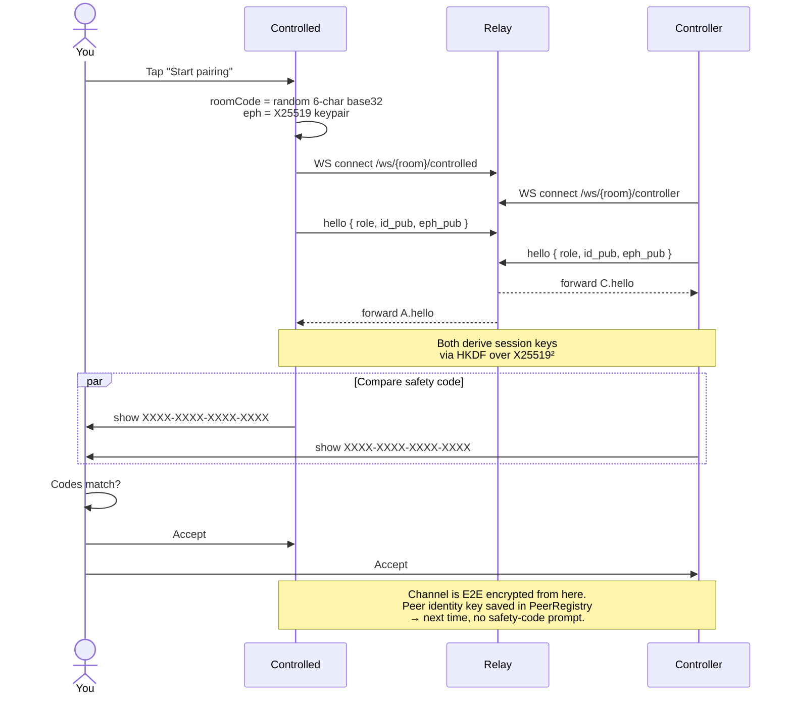
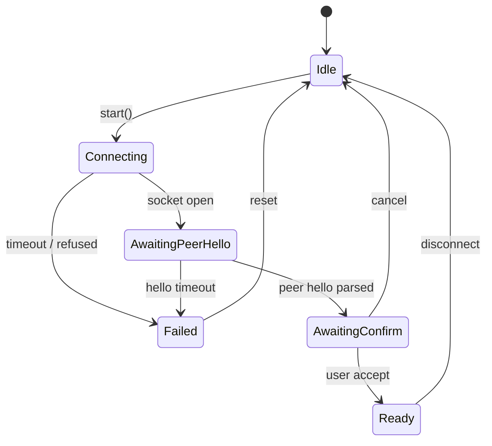

# paperclip-remote

Android-to-Android remote control for **your own two phones**. The
controlled phone shares its screen and accepts taps/swipes/text from
the controller; a tiny self-hosted WebSocket server only forwards
encrypted bytes and never sees plaintext.

Built for the same-owner case (sub-phone, test-phone, tablet alongside
phone) — not a multi-tenant SaaS, not designed for helping a
non-technical relative. Read [`SEED.md`](./SEED.md) before changing
anything; it is the validated spec and code that disagrees with it is
the bug.

---

## How it works



Three independent pieces:

| Piece | What it is | Source |
|---|---|---|
| **Relay** | ~150-line Python (FastAPI + uvicorn). Forwards WebSocket frames between two peers in a room. Sees ciphertext only after the handshake. Rate-limits to 10 joins/min/IP. | [`server/relay.py`](./server/relay.py) |
| **Controller app** | The phone you hold. Renders the peer's screen, sends your taps and text. | [`app/.../ui/ControllerScreen.kt`](./app/src/main/java/com/paperclip/remote/ui/ControllerScreen.kt) |
| **Controlled app** | The phone being driven. Captures its screen, applies the controller's input via an AccessibilityService. | [`app/.../ui/ControlledScreen.kt`](./app/src/main/java/com/paperclip/remote/ui/ControlledScreen.kt) |

Both phones run the **same APK** — the role is chosen per session from the home screen.

---

## Security model



- **Long-lived identity key** per install: X25519, stored in
  `EncryptedSharedPreferences` (Android Keystore-backed).
- **Per-session ephemeral key**: another X25519 keypair freshly
  generated each pairing attempt. Forward secrecy for old sessions
  against later identity-key theft.
- **Session key**: `HKDF-SHA256(salt = transcript, ikm = static_DH ‖
  ephemeral_DH ‖ "paperclip-remote v2 session-key" ‖ transcript)`,
  separate keys per direction.
- **Frame wrap**: every post-handshake WebSocket message is
  ChaCha20-Poly1305 with `nonce = 4 zero bytes ‖ u64_be(counter)`,
  AAD = header. Strict-monotonic counter rejects replays.
- **First-pair MITM defense**: both phones display a **16-hex safety
  code** derived from the two identity pubkeys. If a malicious relay
  substituted either key, the codes differ. User must compare and
  accept.

Full spec: [`docs/PROTOCOL.md`](./docs/PROTOCOL.md). Reference
implementation:
[`docs/protocol_reference.py`](./docs/protocol_reference.py).

---

## Pairing flow



---

## Pairing state machine (in the app)



Implementation:
[`pair/PairingController.kt`](./app/src/main/java/com/paperclip/remote/pair/PairingController.kt).

---

## Quickstart

### 1. Run the relay

```bash
cd server
docker compose up -d
curl http://localhost:8765/healthz      # {"ok": true, "rooms": 0}
```

For phones across the internet you need a public address with TLS.
Easy path: any VPS + Caddy reverse-proxy with `wss://yourhost/` →
`http://relay:8765/`. The phones refuse plain `ws://` in production
builds.

### 2. Build the Android app

```bash
cd app
# In Android Studio Iguana+: Open this folder, let it generate the
# gradle wrapper, then Run on a phone with API 31+.
```

The same APK runs on both phones.

### 3. First pairing (one-time, in person)

The two phones must be near each other for the QR scan.

1. **Controlled side**: open the app → *Share this phone* → enter your
   relay URL (`wss://yourhost/`) → tap **Start pairing**.
2. A QR code + 6-character room code appears. A 16-hex safety code
   shows up once the controller connects.
3. **Controller side**: open the app → *Control another phone* → enter
   the same relay URL → tap **Scan QR** (or type the 6-char code).
4. The same 16-hex safety code appears on the controller phone. **You
   compare the codes by eye.** If they match, tap **Accept** on both.
5. Both phones now show their *Ready* screen. The pair is saved — next
   time they reconnect, no QR / safety code needed.

### 4. Using it — share + control

On the controlled phone:

1. From *Ready*, tap **Start sharing**.
2. Android asks "Allow paperclip-remote to record screen?" — accept.
3. The controller phone's screen now mirrors the controlled phone.

On the controller phone, you can now:

- **Tap** anywhere on the video — registers as a tap at the matching
  pixel on the controlled phone.
- **Drag** — sends a swipe.
- **Hardware keys**: BACK / HOME / RECENTS via the on-screen buttons
  (forthcoming chip row) — already wired through the protocol.

For text input (typing into a remote app), tap a text field on the
controlled phone first so it has keyboard focus, then use the
"**Type…**" entry on the controller. The text is injected via the
AccessibilityService.

For the AccessibilityService to actually dispatch the gestures, the
**controlled** phone must enable it once:

> Settings → Accessibility → paperclip-remote → On

(The app surfaces this as a one-tap deep-link the first time a tap
arrives with no service active.)

### 5. File transfer

Either side, from *Ready*, tap **Send file** → pick any file. The
peer sees a progress row, and when it completes the file lands under
`/Android/data/com.paperclip.remote/cache/received/` on the receiver.
Files are split into 16 KiB AEAD-wrapped chunks; transfers can run in
parallel and out of order.

### 6. Resumed pairing (no QR needed)

Open the app on either side. The peers list shows your saved
devices. Tap one → the channel comes up silently, skipping the
safety-code prompt because the identity key is already known.

### 7. Disconnecting + re-pairing later

*Disconnect* on either side tears the WebSocket down. The identity is
still saved; reconnect any time. To forget a device entirely, delete
it from the peer list.

---

## Project layout

```
android-remote/
├── SEED.md                       validated spec, amend before code
├── README.md                     this file
├── docs/
│   ├── PROTOCOL.md               wire-format normative text
│   ├── ARCHITECTURE.md           module-by-module rationale
│   ├── protocol_reference.py     executable normative reference
│   └── _crosscheck/              regression gates (see §Verification)
├── server/
│   ├── relay.py                  the whole server
│   ├── requirements.txt
│   ├── Dockerfile
│   └── docker-compose.yml
└── app/                          Android (Kotlin + Compose)
    └── src/main/java/com/paperclip/remote/
        ├── crypto/               handshake, AEAD wrap, identity store
        ├── transport/            RelayClient + SecureChannel
        ├── pair/                 PairingController, QR, PeerRegistry
        ├── capture/              MediaProjection → H.264 encoder
        ├── playback/             H.264 decoder → SurfaceView
        ├── input/                AccessibilityService + InputMapper
        ├── files/                FileTransferManager + chunk codec
        ├── session/              SessionHolder (one-slot SecureChannel)
        ├── ui/                   Compose screens
        ├── MainActivity.kt       NavHost
        └── MainViewModel.kt      long-lived collaborators
```

---

## Verification

### Automated regression gates

Run from `docs/_crosscheck/`. Each one prints `ALL OK` and exits 0.

```bash
# 1. Normative-reference self-test (9 cases)
python3 docs/protocol_reference.py

# 2. JVM ↔ Python cryptographic cross-check (12 vectors)
cd docs/_crosscheck
javac CryptoCrossCheck.java && python3 run_crosscheck.py

# 3. End-to-end through the real relay (5-frame round-trip + 4 negatives)
python3 docs/_crosscheck/e2e_integration.py

# 4. InputMapper coordinate math (13 cases)
kotlinc -d /tmp/im app/.../input/InputMapper.kt
kotlinc -cp /tmp/im docs/_crosscheck/InputMapperCheck.kt && java -cp /tmp/im InputMapperCheckKt

# 5. FileChunk wire codec (12 cases)
kotlinc -d /tmp/fc app/.../files/FileChunk.kt
kotlinc -cp /tmp/fc docs/_crosscheck/FileChunkCheck.kt && java -cp /tmp/fc FileChunkCheckKt
```

46 mechanical cases total. They are deliberately fast (<1 s each) so
running all five before a commit is cheap.

### On-device acceptance (`SEED.md §11` DoD)

The Seed defines five must-pass metrics that need a real hardware pair
to measure. Reproduce them as follows:

| Metric | Target | How to measure |
|---|---|---|
| **Input → on-screen feedback** | ≤ 500 ms median | Tap a stopwatch-style app on controlled while filming both phones at 60 fps with a third camera; subtract frame indices. |
| **Video frame rate** | ≥ 20 fps | Adb-pull `logcat` for `H264Encoder` output buffer cadence; or play a 30 fps test pattern on controlled and visually verify smoothness on controller. |
| **Cold-start to first frame** | ≤ 8 s | Time from tapping *Start sharing* to first non-black frame in the controller's VideoSurface. |
| **Pairing time** | ≤ 15 s | Time from *Start pairing* on controlled to *Ready* on controller. |
| **File transfer (1 GiB)** | finishes in < 5 min | Use a known-good 1 GiB file; watch the progress row. |

Record results in `docs/device-acceptance.md` (or a PR comment) with
the hardware pair + Android version + network description, so future
regressions have a baseline to compare against.

Compose UI, MediaProjection ↔ codec, CameraX scanner, and
AccessibilityService dispatch all need a device — they have **no**
mechanical gate in this repo and depend on the on-device acceptance run.

---

## Current state

- [x] Wire protocol v2 — E2E AEAD, see [`docs/PROTOCOL.md`](./docs/PROTOCOL.md)
- [x] Relay server + docker-compose + rate-limit + room-id check
- [x] Identity store, X25519 handshake, ChaCha20-Poly1305 wrap
- [x] MediaProjection capture + H.264 encoder + decoder
- [x] PairingController + safety-code UI + PeerRegistry
- [x] AccessibilityService input (taps, swipes, BACK/HOME/RECENTS, text)
- [x] InputMapper (FIT / STRETCH, letterbox-aware)
- [x] Decoder Surface playback + touch routing
- [x] CameraX QR scanner (manual code still works)
- [x] Bidirectional file transfer (16 KiB chunks, out-of-order tolerant)
- [ ] On-device acceptance run (`SEED §11`) — depends on hardware

See [`SEED.md §11`](./SEED.md) for the formal definition of done.

---

## Spec & docs

- **[`SEED.md`](./SEED.md)** — validated spec. Edit this before
  changing any behaviour; mismatches between code and Seed are bugs in
  the code.
- **[`docs/PROTOCOL.md`](./docs/PROTOCOL.md)** — wire format,
  handshake, AEAD wrap.
- **[`docs/ARCHITECTURE.md`](./docs/ARCHITECTURE.md)** — why the
  modules are split the way they are.
- **[`docs/protocol_reference.py`](./docs/protocol_reference.py)** —
  executable normative reference for the cryptographic protocol.
- **[`docs/_crosscheck/README.md`](./docs/_crosscheck/README.md)** —
  the five regression gates and how to run them.
