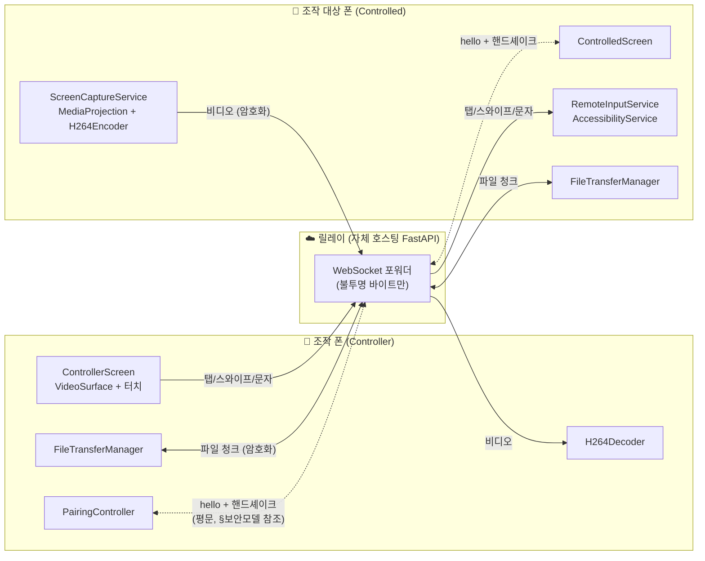
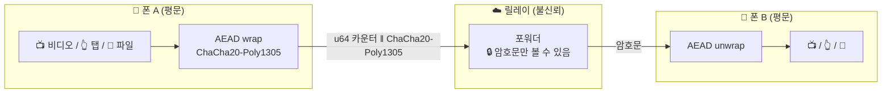
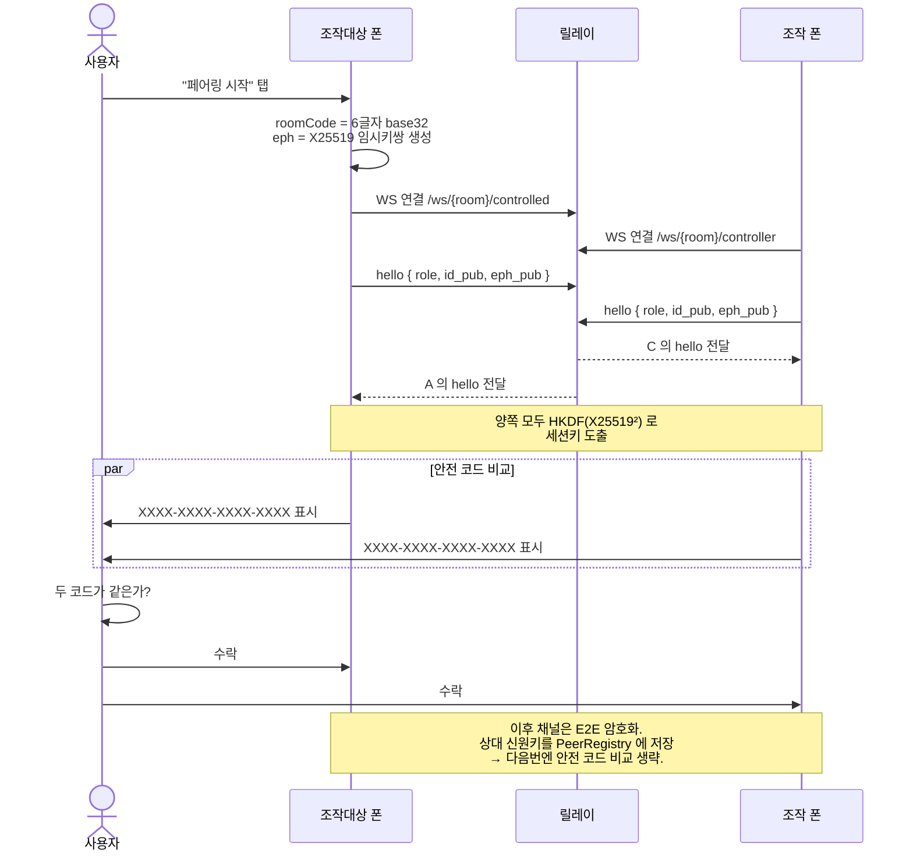
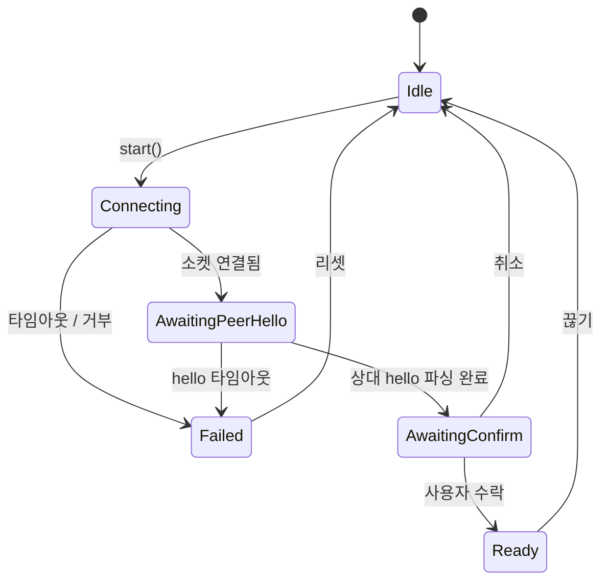

# paperclip-remote

**내 두 안드로이드 폰을 서로 원격조작하는 앱.** 조작 대상 폰이 화면을 공유하고,
조작하는 폰의 탭/스와이프/문자/파일을 받습니다. 가운데에는 본인이 직접 호스팅하는
얇은 WebSocket 릴레이만 있고, 핸드셰이크 이후의 모든 트래픽은
ChaCha20-Poly1305 로 종단간 암호화되어 **릴레이는 평문을 볼 수 없습니다**.

본인 소유의 두 단말끼리 쓰는 용도로 설계됐습니다 (서브폰, 테스트폰, 같이 쓰는
태블릿). 다중 사용자 SaaS, 비기술 사용자 원격지원, IT 헬프데스크 용도가 아닙니다.

코드 수정 전에 [`SEED.md`](./SEED.md) 를 먼저 읽으세요 — 검증된 명세이고,
이와 어긋나는 코드는 코드 쪽 버그입니다.

---

## 동작 방식



세 구성요소:

| 구성요소 | 설명 | 소스 |
|---|---|---|
| **릴레이** | ~150 줄 파이썬 (FastAPI + uvicorn). 두 피어 사이의 WebSocket 프레임을 그대로 전달. 핸드셰이크 이후엔 암호문만 봄. IP 당 분당 10회 입장 제한. | [`server/relay.py`](./server/relay.py) |
| **조작 폰 앱** | 상대 폰 화면을 보여주고 내 터치/문자를 전송. | [`app/.../ui/ControllerScreen.kt`](./app/src/main/java/com/paperclip/remote/ui/ControllerScreen.kt) |
| **조작 대상 폰 앱** | 자기 화면을 캡처하고, 받은 입력을 AccessibilityService 로 디스패치. | [`app/.../ui/ControlledScreen.kt`](./app/src/main/java/com/paperclip/remote/ui/ControlledScreen.kt) |

두 폰 모두 **동일한 APK** 를 설치합니다 — 역할은 매 세션마다 홈 화면에서 고름.

---

## 보안 모델



- **장기 신원키** (단말당 1개): X25519, `EncryptedSharedPreferences` 에
  저장 (Android Keystore 보호).
- **세션 임시키**: 매 페어링마다 새로 생성하는 X25519 키쌍. 신원키가 나중에
  유출되어도 과거 세션은 보호됨 (forward secrecy).
- **세션키 도출**: `HKDF-SHA256(salt = transcript, ikm = static_DH ‖
  ephemeral_DH ‖ "paperclip-remote v2 session-key" ‖ transcript)`.
  방향별로 다른 키를 사용.
- **프레임 래핑**: 핸드셰이크 이후 모든 WebSocket 메시지는
  ChaCha20-Poly1305 로 암호화. `nonce = 4 zero bytes ‖ u64_be(카운터)`,
  AAD = header. 엄격한 단조증가 카운터로 재전송 공격 방지.
- **첫 페어링 MITM 방어**: 두 폰 모두 두 신원키로부터 유도된 **16자리
  16진수 안전 코드** 를 표시. 악의적 릴레이가 키를 바꾸면 코드가 달라지므로
  사용자가 눈으로 비교 후 수락.

전체 스펙: [`docs/PROTOCOL.md`](./docs/PROTOCOL.md).
참조 구현: [`docs/protocol_reference.py`](./docs/protocol_reference.py).

---

## 페어링 흐름



---

## 페어링 상태 머신



구현: [`pair/PairingController.kt`](./app/src/main/java/com/paperclip/remote/pair/PairingController.kt).

---

# 내부 서버 구성하기

릴레이는 **본인 소유 서버 한 대** 에서 돌립니다. 두 폰이 모두 인터넷으로
도달할 수 있어야 합니다. 가정용 NAS, VPS, 회사 내부망 서버 어디든
가능합니다.

## 옵션 B (권장) — Caddy 자동 TLS, 한 명령 배포

`docker-compose.yml` 에 Caddy 사이드카가 프로필로 들어있어, 도메인 하나만
있으면 다음 한 번에 끝납니다.

### 사전 준비

1. **도메인 1개** — 자체 도메인이 없으면 [DuckDNS](https://www.duckdns.org/)
   (무료) 에서 `yourname.duckdns.org` 발급
2. **공인 IP** — 가정 회선이면 CGNAT 가 아닌지 확인 (`whatismyip.com` 와
   공유기 WAN IP 가 같아야 함)
3. **포트 80 + 443 외부 노출** — 공유기 포트포워드 또는 클라우드 보안그룹
4. 도메인의 A 레코드를 위 IP 로 가리킴

### 배포

```bash
cd android-remote/server

# 1. .env 작성
cp .env.example .env
$EDITOR .env       # DOMAIN=remote.example.com 한 줄만 채우면 됨

# 2. 릴레이 + Caddy 한 번에 기동 (--profile tls 가 핵심)
docker compose --profile tls up -d

# 3. 초기 발급 30초~1분 대기 후 헬스체크
sleep 60
curl -fsSL https://remote.example.com/healthz
# {"ok":true,"rooms":0}
```

이게 끝입니다. Caddy 가:
- Let's Encrypt 인증서를 알아서 발급 (HTTP-01 challenge)
- 60일마다 자동 갱신
- HTTP/2 + HTTP/3 (QUIC) 지원
- HSTS 등 보안 헤더 자동 부착

폰의 *Relay URL*: `wss://remote.example.com/` — 운영 빌드 그대로 사용 가능.

### Caddyfile 커스터마이즈

기본 [`server/Caddyfile`](./server/Caddyfile) 은 최소 구성입니다. 더 필요한
경우 (basic-auth, IP allow-list, fail2ban 등) 그 파일을 수정 후
`docker compose --profile tls restart caddy`.

### 운영 확인

```bash
# 인증서 발급 로그
docker compose logs caddy | head -30

# 릴레이 자체 로그
docker compose logs -f relay

# 입장 분당 10회 제한이 진짜 클라이언트 IP 기준으로 동작하는지 확인
# (Caddy 가 X-Forwarded-For 자동 부착, 릴레이가 _client_ip() 로 읽음)
```

## 옵션 A — 로컬 네트워크 안에서만 (TLS 불필요)

같은 Wi-Fi 안에서만 쓸 거면 TLS 도 외부 도메인도 필요 없습니다. 단,
**운영 빌드는 평문 `ws://` 를 거부**하므로 디버그 APK 가 필요합니다.

```bash
cd android-remote/server

# .env 에서 LAN 노출 허용
cp .env.example .env
echo "RELAY_BIND=0.0.0.0" >> .env

# Caddy 없이 릴레이만
docker compose up -d
curl http://localhost:8765/healthz
# {"ok":true,"rooms":0}
```

폰의 *Relay URL*: `ws://192.168.x.x:8765/` (호스트의 LAN IP).

기본 `.env` 에선 `RELAY_BIND=127.0.0.1` 로 호스트 루프백에만 바인딩하니,
실수로 LAN 에 8765 가 열려있을 일은 없습니다. LAN 노출을 *원할 때만*
명시적으로 `0.0.0.0` 으로 바꾸세요.

## 옵션 C — Caddy 말고 nginx 가 좋다면

이미 nginx + certbot 으로 운영중이면 sidecar 안 띄우고 호스트 nginx 에
연결:

```nginx
# /etc/nginx/sites-available/paperclip-remote
server {
    listen 443 ssl http2;
    server_name remote.example.com;
    ssl_certificate     /etc/letsencrypt/live/remote.example.com/fullchain.pem;
    ssl_certificate_key /etc/letsencrypt/live/remote.example.com/privkey.pem;

    location / {
        proxy_pass http://127.0.0.1:8765;
        proxy_http_version 1.1;
        proxy_set_header Upgrade $http_upgrade;
        proxy_set_header Connection "upgrade";
        proxy_set_header X-Real-IP $remote_addr;
        proxy_set_header X-Forwarded-For $proxy_add_x_forwarded_for;
        proxy_read_timeout 86400s;     # 장기 WebSocket 유지
        proxy_send_timeout 86400s;
    }
}
```

```bash
# 릴레이는 호스트 루프백에만
cd android-remote/server
docker compose up -d   # .env 의 기본 RELAY_BIND=127.0.0.1 그대로

sudo certbot --nginx -d remote.example.com
sudo systemctl reload nginx
```

릴레이가 `X-Real-IP` / `X-Forwarded-For` 둘 다 인식하므로 분당 10회
제한이 원래 IP 기준으로 정확히 적용됩니다.

## 옵션 D — Docker 없이 직접 실행 (systemd)

`/etc/systemd/system/paperclip-relay.service`:

```ini
[Unit]
Description=paperclip-remote WebSocket relay
After=network.target

[Service]
Type=simple
WorkingDirectory=/opt/paperclip-remote/server
ExecStart=/usr/bin/uvicorn relay:app --host 127.0.0.1 --port 8765
Restart=on-failure
User=paperclip

[Install]
WantedBy=multi-user.target
```

```bash
sudo -u paperclip git clone https://github.com/dnr6419/paperclip /opt/paperclip-remote
cd /opt/paperclip-remote/android-remote/server
sudo -u paperclip pip install --user -r requirements.txt
sudo systemctl daemon-reload
sudo systemctl enable --now paperclip-relay
```

## 동작 확인

```bash
# 헬스체크
curl -fsSL https://remote.example.com/healthz
# {"ok":true,"rooms":0}

# 부적합 룸 ID 거부 확인 (rate-limit / 규칙 검증)
curl -i https://remote.example.com/ws/badid/controller  # 426 Upgrade Required (정상)

# 풀 회귀 게이트 통과 확인 (선택)
cd /opt/paperclip-remote/android-remote/docs/_crosscheck
python3 e2e_integration.py
# ALL OK -- full v2 protocol round-trip through the real relay.
```

## 운영 팁

- **포트 8765 는 외부 노출 불필요** — 모든 외부 트래픽은 reverse proxy(443) 로.
- **인입 IP 기반 입장 제한**: 분당 10회 (`MAX_JOIN_PER_MIN`). 페어링 코드
  무차별 추측 방어. nginx/Caddy 에서 `X-Real-IP` 또는 `X-Forwarded-For` 헤더를
  넘기지 않으면 모든 인입이 reverse proxy IP 로 보여 의미 없는 제한이 되니
  주의.
- **세션 트래픽은 옵저버블 데이터 없음**: 릴레이 로그에는 입장/퇴장과 룸 ID
  만 남음. 평문이 안 보이는 만큼 디버깅도 안 됨 — 앱 쪽 logcat 으로 확인.
- **자체서명 인증서**: 임시 테스트라면 가능하지만 OkHttp 가 신뢰 스토어에
  추가된 인증서가 아니면 거부함. `wss://` 강제 정책상 별도 설정 작업이
  필요해 권장하지 않음. 운영용으론 Let's Encrypt 사용 권장.

---

# 모바일에서 사용하기

## 사전 준비

- **Android 12 이상** (API 31+) 폰 두 대
- 두 폰에 같은 APK 설치
- 릴레이 URL (위 옵션 A~D 중 하나로 구축한 주소)
- 첫 페어링은 **두 폰을 가까이 둔 상태에서** (QR 스캔 때문)

## APK 빌드

```bash
# Android Studio Iguana+ 에서:
#   File → Open → android-remote/app
#   Gradle sync 후 ▶ Run 'app' (디바이스 두 대 각각)
#
# 또는 커맨드라인:
cd android-remote/app
./gradlew assembleDebug
# app/build/outputs/apk/debug/app-debug.apk
adb -s <device-A> install -r app/build/outputs/apk/debug/app-debug.apk
adb -s <device-B> install -r app/build/outputs/apk/debug/app-debug.apk
```

## 1단계 — 첫 실행 + 권한 설정

조작 대상 폰(controlled) 에서 두 가지 권한이 필요합니다. 앱이 처음 필요한
타이밍에 안내해주지만, 미리 켜둬도 됩니다.

1. **접근성 서비스 (AccessibilityService)** — 원격 탭/스와이프/문자
   주입을 위해 필요
   - 설정 → 접근성 → paperclip-remote → 켜기
   - 이 권한은 *조작 대상* 폰에만 필요. 조작 폰엔 불필요.
2. **화면 녹화 (MediaProjection)** — 화면 공유 시작할 때마다 시스템
   다이얼로그가 떠서 매번 수락해야 함 (OS 정책상 영구화 불가)

조작 폰(controller) 에선 카메라 권한만 필요 (QR 스캔용).

## 2단계 — 첫 페어링 (1회만)

두 폰을 가까이 두세요.

### 조작 대상 폰에서

1. 앱 실행 → **"Share this phone"**
2. *Relay URL* 에 `wss://remote.example.com/` (혹은 `ws://192.168.x.x:8765/`) 입력
3. **"Start pairing"** 탭
4. 큰 QR 코드와 6자리 코드가 나타남
5. 잠시 후 16자리 안전 코드 (`XXXX-XXXX-XXXX-XXXX`) 가 표시됨

### 조작 폰에서 (병행)

1. 앱 실행 → **"Control another phone"**
2. *Relay URL* 에 같은 주소 입력
3. **"Scan QR"** 탭 → 카메라 권한 허용 → 상대 폰 화면 비춤
4. 잠시 후 같은 16자리 안전 코드가 표시됨

### 양쪽에서

5. **두 폰의 안전 코드가 같은지 눈으로 비교** (악의적 릴레이가 키를 바꿔치기
   하면 여기서만 다르게 나타남)
6. 같으면 양쪽 **"Accept"**

이제 두 폰이 페어링됨. 신원키가 저장되어 **다음번 부턴 QR 스캔 / 안전 코드
비교 생략** 됩니다.

## 3단계 — 화면 공유 + 조작

### 조작 대상 폰에서

1. 페어링 후 *Ready* 화면 → **"Start sharing"** 탭
2. 시스템 다이얼로그 "paperclip-remote에서 화면 녹화를 허용하시겠습니까?" → **시작**

### 조작 폰에서

- 상대 폰의 화면이 영상으로 나타남
- **탭** — 그 위치를 상대 폰에서 탭
- **드래그** — 스와이프로 전달
- **BACK / HOME / RECENTS 버튼** — 하단 컨트롤 행에서 탭

화면 비율이 안 맞으면 (가로 폰을 세로 폰에서 보거나 그 반대) 위/아래 또는
좌우에 검은 띠가 생기며, 그 영역의 터치는 무시됨 (전송 안 됨).

## 4단계 — 문자 입력 + 클립보드

### 문자 입력 (조작 폰 → 조작 대상)

1. 조작 대상 폰의 어떤 텍스트 필드 (검색창, 메모, 메신저 등) 를 탭해서
   포커스 줌 (원격 탭으로 가능)
2. 조작 폰의 *Ready* 화면 → "Type text to send..." 입력 → **"Type"**
3. 조작 대상 폰의 포커스된 필드에 문자가 자동 입력됨

(접근성 서비스의 `ACTION_SET_TEXT` 사용. 포커스된 필드가 없으면 조용히 무시.)

### 클립보드 전송

양쪽 모두 *Ready* 화면에 **"Push clipboard"** 가 있음.

- 내 폰의 현재 클립보드를 상대 폰의 클립보드로 푸시
- 단, **Android 10+ 제약**: 받는 쪽 앱이 백그라운드면 OS 가 클립보드 쓰기를
  막을 수 있음 (조용히 실패). 받는 쪽 폰에서 paperclip 앱이 표시되어 있을 때
  쓰는 게 확실함.

## 5단계 — 파일 전송 (양방향)

양쪽 모두 *Ready* 화면에 **"Send file"** 버튼.

1. 탭 → 시스템 파일 선택기 → 보낼 파일 선택
2. 진행 행이 양쪽에 나타나며 % 증가
3. 완료되면 받는 쪽에 저장 경로 표시 (보통
   `/Android/data/com.paperclip.remote/cache/received/`)

파일은 16 KiB 청크로 나뉘어 암호화되어 전송. 여러 파일을 동시에 보낼 수도
있고, 청크가 순서 뒤바뀌어 도착해도 올바른 위치에 기록됨.

## 6단계 — 다음번 자동 연결

1. 앱 실행 → 역할 선택 (Control / Share)
2. 저장된 페어가 목록에 보임 → 탭
3. 핸드셰이크가 자동으로 진행됨 (안전 코드 비교 단계 생략, 신원키 검증으로
   대체)
4. *Ready* 화면 즉시 진입

저장된 페어는 신원키 변경 (앱 재설치 등) 이 없는 한 계속 유효.

## 7단계 — 끊기 + 재페어링

- **"Disconnect"** — WebSocket 만 닫음. 저장된 페어는 그대로. 언제든 다시
  연결 가능.
- 페어를 완전히 잊으려면 peer 목록에서 삭제. 그러면 다음번 페어링은 QR 부터
  다시 시작해야 함.

## 트러블슈팅

| 증상 | 원인 | 해결 |
|---|---|---|
| 운영 빌드에서 `ws://` 거부됨 | 보안 정책 | `wss://` 로 (TLS 켠 릴레이 사용) 혹은 디버그 빌드 사용 |
| 안전 코드가 다르게 나옴 | 릴레이가 키 바꿔치기 시도했거나 진짜 다른 폰에 연결됨 | **수락하지 말 것**. 릴레이를 의심하거나 다른 룸 코드 확인 |
| 페어링 완료됐는데 화면이 안 보임 | 조작 대상이 "Start sharing" 안 눌렀거나 MediaProjection 거부됨 | Controlled 화면에서 "Start sharing" 다시 탭 |
| 탭이 안 먹힘 | AccessibilityService 비활성 | 설정 → 접근성 → paperclip-remote → 켜기 |
| "Type" 버튼 눌러도 입력 안 됨 | 상대 폰에 포커스된 텍스트 필드 없음 | 먼저 상대 폰 텍스트 필드를 원격 탭으로 포커스 |
| 클립보드 푸시했는데 안 들어옴 | 받는 쪽 앱이 백그라운드 (Android Q+ 제약) | 받는 폰에서 paperclip 앱을 잠시 표시 |
| 파일 전송 도중 끊김 | 네트워크 흔들림 | 자동 재연결되며 미완료 파일은 삭제됨. 재시도 |
| 분당 입장 10회 초과로 거부 | 페어링 코드 잘못 입력 반복 | 1분 기다린 후 재시도 |

---

## 검증

### 자동 회귀 게이트

`docs/_crosscheck/` 에 5개의 자동 검증 게이트가 있습니다. 모두 `ALL OK` 출력
후 종료 코드 0 반환.

```bash
# 1. 참조 구현 자가검증 (9 케이스)
python3 docs/protocol_reference.py

# 2. JVM ↔ Python 크립토 크로스체크 (12 벡터)
cd docs/_crosscheck
javac CryptoCrossCheck.java && python3 run_crosscheck.py

# 3. 실 릴레이를 통한 풀 라운드트립 (프레임 5개 양방향 + 네거티브 4개)
python3 e2e_integration.py

# 4. InputMapper 좌표 변환 (13 케이스)
kotlinc -d /tmp/im ../../app/src/main/java/com/paperclip/remote/input/InputMapper.kt
kotlinc -cp /tmp/im InputMapperCheck.kt && \
  java -cp /tmp/im:$KOTLIN_HOME/lib/kotlin-stdlib.jar InputMapperCheckKt

# 5. FileChunk 와이어 코덱 (12 케이스)
kotlinc -d /tmp/fc ../../app/src/main/java/com/paperclip/remote/files/FileChunk.kt
kotlinc -cp /tmp/fc FileChunkCheck.kt && \
  java -cp /tmp/fc:$KOTLIN_HOME/lib/kotlin-stdlib.jar FileChunkCheckKt
```

총 **46 케이스**, 각각 1초 미만이라 커밋 전에 다 돌려도 부담 없음.

### 실기기 수용 기준 (SEED §11 DoD)

5개의 필수 통과 지표는 실 하드웨어 페어가 필요합니다. 측정 절차는
[`docs/device-acceptance.md`](./docs/device-acceptance.md) 에 양식화돼
있고, 측정 결과는 PR 코멘트나 같은 문서에 기록.

| 지표 | 목표 | 도전 |
|---|---|---|
| 입력 → 화면 반영 (median) | ≤ 500 ms | ≤ 300 ms |
| 비디오 프레임 | ≥ 20 fps | ≥ 30 fps |
| 콜드 스타트 → 첫 프레임 | ≤ 8 s | ≤ 5 s |
| 페어링 (코드 → 연결됨) | ≤ 15 s | ≤ 10 s |
| 1 GiB 파일 전송 | < 5 분 | < 3 분 |

---

## 프로젝트 구조

```
android-remote/
├── SEED.md                       검증된 명세 — 코드보다 먼저 수정
├── README.md                     이 문서
├── docs/
│   ├── PROTOCOL.md               와이어 포맷 정규 명세
│   ├── ARCHITECTURE.md           모듈별 설계 근거
│   ├── TICKETS.md                작업 단위 ↔ DOF-R-NNN 매핑
│   ├── device-acceptance.md      실기기 검증 양식 + 결과
│   ├── protocol_reference.py     실행 가능 정규 참조 구현
│   └── _crosscheck/              회귀 게이트 (위 §검증 참조)
├── server/
│   ├── relay.py                  릴레이 전체 (단일 파일)
│   ├── requirements.txt
│   ├── Dockerfile
│   └── docker-compose.yml
└── app/                          Android (Kotlin + Compose)
    └── src/main/java/com/paperclip/remote/
        ├── crypto/               핸드셰이크, AEAD wrap, 신원키 저장
        ├── transport/            RelayClient + SecureChannel
        ├── pair/                 PairingController, QR, PeerRegistry
        ├── capture/              MediaProjection → H.264 인코더
        ├── playback/             H.264 디코더 → SurfaceView
        ├── input/                AccessibilityService + InputMapper
        ├── files/                FileTransferManager + 청크 코덱
        ├── session/              SessionHolder (단일 슬롯 SecureChannel)
        ├── ui/                   Compose 화면
        ├── MainActivity.kt       NavHost
        └── MainViewModel.kt      장기 collaborator 보관
```

---

## 현재 상태

- [x] 와이어 프로토콜 v2 (E2E, [`docs/PROTOCOL.md`](./docs/PROTOCOL.md))
- [x] 릴레이 서버 + docker-compose + 입장 제한 + 룸 ID 검증
- [x] 신원키 저장, X25519 핸드셰이크, ChaCha20-Poly1305 wrap
- [x] MediaProjection 캡처 + H.264 인코더 + 디코더
- [x] PairingController + 안전 코드 UI + PeerRegistry
- [x] AccessibilityService 입력 (탭, 스와이프, BACK/HOME/RECENTS, 문자)
- [x] InputMapper (FIT / STRETCH, letterbox 인지)
- [x] 디코더 Surface 재생 + 터치 라우팅
- [x] CameraX QR 스캐너 (수동 코드 입력도 가능)
- [x] 양방향 파일 전송 (16 KiB 청크)
- [x] 문자 주입 + 클립보드 푸시 (v1.1)
- [x] 하드웨어 키 chip row + 화질 조정 UI
- [x] Gradle wrapper (헤드리스 빌드 가능)
- [x] 소켓 끊김 시 자동 재연결
- [ ] 실기기 수용 측정 (`SEED §11`) — 하드웨어 의존

세부 작업 단위와 후속 항목은
[`docs/TICKETS.md`](./docs/TICKETS.md) 참조.

---

## 스펙 & 문서

- **[`SEED.md`](./SEED.md)** — 검증된 명세. 동작을 바꾸기 전에 먼저 수정.
- **[`docs/PROTOCOL.md`](./docs/PROTOCOL.md)** — 와이어 포맷, 핸드셰이크,
  AEAD wrap.
- **[`docs/ARCHITECTURE.md`](./docs/ARCHITECTURE.md)** — 모듈을 왜 그렇게
  나눴는지.
- **[`docs/protocol_reference.py`](./docs/protocol_reference.py)** —
  실행 가능한 정규 참조 (스펙 본문과 충돌하면 이쪽이 정답).
- **[`docs/_crosscheck/README.md`](./docs/_crosscheck/README.md)** —
  5개 회귀 게이트 실행법.
- **[`docs/TICKETS.md`](./docs/TICKETS.md)** — 작업 단위 ↔ DOF-R-NNN 매핑
  + 커밋 컨벤션.
